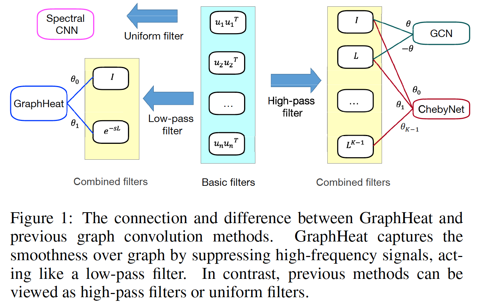

## Graph Convolutional Networks using Heat Kernel for Semi-supervised Learning
> Convolutional Networks using Heat Kernel for Semi-supervised Learning. Bingbing Xu, Huawei Shen, Qi Cao, Keting Cen, Xueqi Cheng. IJCAI, 2019. [pdf](https://www.ijcai.org/Proceedings/2019/0267.pdf)

## Overview

 

> We provide a TensorFlow implementation of GraphHeat. The key to graph-based semisupervised learning is capturing the smoothness of labels or features over nodes exerted by graph structure. Previous methods, spectral methods and spatial methods, devote to defining graph convolution as a weighted average over neighboring nodes, and then learn graph convolution kernels to leverage the smoothness to improve the performance of graph-based semi-supervised learning. One open challenge is how to determine appropriate neighborhood that reflects relevant information of smoothness manifested in graph structure. In this paper, we propose GraphHeat, leveraging heat kernel to enhance low-frequency filters and enforce smoothness in the signal variation on the graph. GraphHeat leverages the local structure of target node under heat diffusion to determine its neighboring nodes flexibly, without the constraint of order suffered by previous methods. GraphHeat

## Requirements
the script has been tested running under Python 2.7, with the following packages installed (along with their dependencies):
* tensorflow==0.12.0
* numpy==1.14.0
* scipy==0.19.1
* networkx==2.0

## Run the Code
* cd code
* python train.py

## Parameters
* --wavelet_s                 FLOAT         wavelet scaling parameter.                  
* --threshold                 FLOAT         threshold parameter for wavelet.            
* --epochs                    INT           Number of Adam epochs.                      
* --early-stopping            INT           Number of early stopping epochs.            

## Cite
Please cite our paper if you use this code in your own work:

> @inproceedings{xu2019graph,
  title={Graph convolutional networks using heat kernel for semi-supervised learning},
  author={Xu, Bingbing and Shen, Huawei and Cao, Qi and Cen, Keting and Cheng, Xueqi},
  booktitle={Proceedings of the 28th International Joint Conference on Artificial Intelligence},
  pages={1928--1934},
  year={2019},
  organization={AAAI Press}
}

## Acknowledgement

> Some sections of code adapted from tkipf/gcn(https://github.com/tkipf/gcn)
